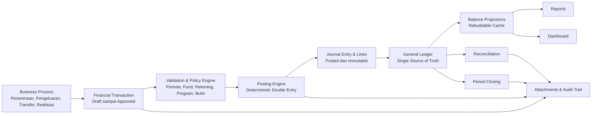
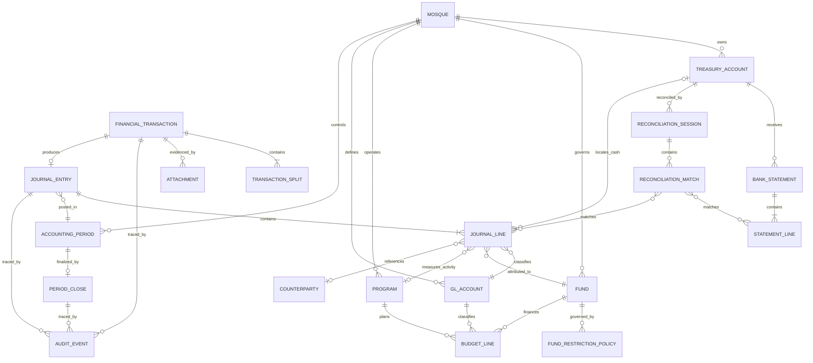
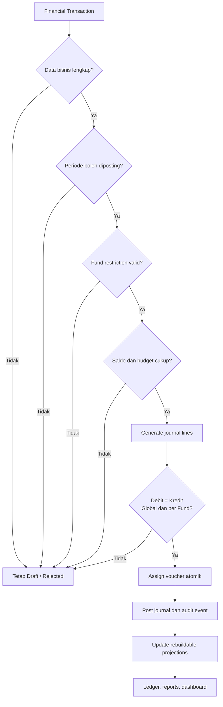

# Financial Architecture V2

## Sistem Fund Accounting untuk Sistem Informasi Manajemen Masjid

**Status:** Proposed Architecture  
**Versi:** 2.0  
**Tanggal:** 4 Agustus 2026  
**Cakupan:** Desain bisnis, domain, accounting, ledger, control, reporting, dan roadmap implementasi modul Keuangan  
**Di luar cakupan:** Kode aplikasi, skema tabel fisik, migration, controller, model, repository, dan detail framework

---

## 1. Ringkasan Eksekutif

Financial Architecture V2 mengubah modul Keuangan dari kumpulan fitur kas yang menghitung saldo dari beberapa tabel menjadi sistem **Fund Accounting** dengan **General Ledger sebagai satu-satunya sumber kebenaran**.

Keputusan arsitektur terpenting adalah:

1. **Rekening, Dana, Program, dan Akun adalah empat konsep berbeda.** Keempatnya tidak boleh saling menggantikan.
2. **Rekening dan Dana bukan hubungan induk-anak yang kaku.** Satu rekening dapat menampung banyak dana, dan satu dana dapat tersebar pada beberapa rekening. Hubungannya terbentuk melalui baris jurnal.
3. **Program adalah dimensi penggunaan atau cost center**, bukan pemilik saldo dan bukan identitas dana.
4. **Setiap transaksi yang berpengaruh secara finansial wajib diposting melalui Posting Engine.** Tidak ada proses bisnis yang menulis saldo secara langsung.
5. **General Ledger yang sudah diposting bersifat append-only.** Kesalahan diperbaiki dengan reversal atau adjustment, bukan mengedit jurnal lama.
6. **Saldo tidak disimpan sebagai angka yang dapat diubah.** Saldo dihitung dari ledger. Snapshot dan projection diperbolehkan hanya sebagai cache yang selalu dapat dibangun ulang.
7. **Transfer rekening, transfer antar dana, budget allocation, dan realisasi adalah proses berbeda.** Masing-masing memiliki dampak accounting yang berbeda.
8. **Dana terikat dikendalikan oleh kebijakan penggunaan**, bukan hanya oleh nama akun atau pilihan pada antarmuka.
9. **Closing dan rekonsiliasi menjadi kontrol inti**, bukan fitur tambahan.
10. **Laporan dan dashboard membaca ledger atau read model yang diturunkan dari ledger**, tidak membaca subtotal dari tabel transaksi operasional yang terpisah.

Target akhirnya adalah sistem yang dapat menjawab secara konsisten:

- Berapa saldo setiap rekening?
- Dana apa saja yang membentuk saldo suatu rekening?
- Di rekening mana sebuah dana tersimpan?
- Berapa saldo tersedia setiap dana?
- Program apa yang menggunakan dana tersebut?
- Transaksi dan bukti apa yang menyebabkan perubahan saldo?
- Apakah saldo buku sudah cocok dengan bank atau kas fisik?
- Apakah sebuah periode sudah final dan tidak berubah lagi?

---

## 2. Prinsip Arsitektur

### 2.1 Prinsip accounting

- Setiap posting harus memenuhi **total debit = total kredit**.
- Setiap angka pada laporan harus dapat ditelusuri sampai ke journal line, transaksi sumber, dan bukti.
- Internal transfer tidak boleh menciptakan pendapatan atau beban.
- Pendapatan dan beban harus dicatat pada dana yang benar.
- Perubahan kepemilikan antar dana harus eksplisit sebagai interfund transfer atau reclassification.
- Restricted fund tidak boleh menjadi unrestricted fund hanya karena dipindahkan ke rekening lain.
- Saldo rekening tidak sama dengan saldo dana.
- Saldo dana tidak sama dengan sisa budget program.

### 2.2 Prinsip sistem

- **Single Source of Truth:** hanya posted ledger yang menjadi sumber saldo resmi.
- **Immutability:** posted journal tidak diedit atau dihapus.
- **Idempotency:** satu business event hanya boleh menghasilkan satu posting resmi.
- **Atomicity:** transaksi bisnis, jurnal, nomor voucher, dan audit event harus berhasil atau gagal sebagai satu kesatuan.
- **Traceability:** setiap journal entry wajib memiliki sumber dan alasan bisnis.
- **Determinism:** input dan posting rule yang sama harus menghasilkan jurnal yang sama.
- **Rebuildable projection:** dashboard dan laporan cepat boleh memakai projection, tetapi dapat direkonstruksi dari ledger.
- **Period control:** tanggal accounting hanya dapat diposting pada periode yang diizinkan.

### 2.3 Prinsip domain

- Bahasa pada sistem harus sama dengan bahasa operasional bendahara: rekening, dana, program, penerimaan, pengeluaran, transfer, alokasi, realisasi, closing, dan rekonsiliasi.
- Validasi accounting dan validasi pembatasan dana berada di domain Keuangan, bukan hanya di UI.
- Perubahan kebijakan tidak boleh mengubah histori. Posting rule dan policy yang dipakai harus dapat diketahui versinya.

---

## 3. Definisi Konsep Utama

| Konsep | Definisi | Bukan |
|---|---|---|
| **Rekening** | Tempat fisik atau instrumen tempat aset likuid disimpan, misalnya kas tunai, petty cash, rekening bank, atau dompet digital. | Bukan Dana, Program, Pendapatan, atau kategori transaksi. |
| **Dana / Fund** | Kumpulan sumber daya dengan batasan, tujuan, atau kepemilikan tertentu yang harus dipertanggungjawabkan terpisah. | Bukan rekening bank dan bukan program kegiatan. |
| **Program** | Dimensi kegiatan atau cost center tempat dana digunakan dan kinerja anggaran diukur. | Bukan sumber dana dan tidak otomatis memiliki saldo kas. |
| **Akun / GL Account** | Klasifikasi accounting dalam Chart of Accounts untuk aset, liabilitas, net assets, pendapatan, beban, dan transfer. | Bukan transaksi dan bukan saldo yang disimpan manual. |
| **Kategori** | Label operasional untuk mempermudah input, analisis, dan pemilihan posting rule. | Bukan pengganti akun atau dana. |
| **Transaksi Bisnis** | Fakta atau dokumen operasional, misalnya penerimaan donasi, pembayaran listrik, transfer bank, atau distribusi santunan. | Bukan journal line dan belum memengaruhi saldo sebelum posted. |
| **Jurnal** | Representasi double-entry dari transaksi bisnis yang sudah siap memengaruhi ledger. Terdiri dari header dan dua atau lebih journal lines. | Bukan form transaksi dan bukan laporan. |
| **Ledger** | Kumpulan immutable posted journal lines yang tersusun menurut tanggal accounting, akun, dana, rekening, program, dan dimensi lain. | Bukan cache saldo atau tabel rekap manual. |
| **Saldo Rekening** | Saldo buku akun kas/bank tertentu yang dihitung dari ledger. | Bukan jumlah seluruh dana secara otomatis tanpa melihat dimensinya. |
| **Saldo Dana** | Nilai bersih sumber daya yang dimiliki sebuah fund berdasarkan seluruh journal lines fund tersebut. | Bukan saldo satu rekening dan bukan budget program. |
| **Budget** | Rencana penggunaan dana yang disetujui untuk periode/program/akun tertentu. | Bukan transaksi aktual dan tidak selalu menghasilkan jurnal. |
| **Realisasi** | Penggunaan aktual yang sah terhadap budget atau tujuan fund dan dibuktikan oleh transaksi pengeluaran/distribusi. | Bukan alokasi rencana. |

### 3.1 Relasi Rekening–Dana yang benar

Desain tidak boleh menetapkan bahwa satu Dana hanya berada pada satu Rekening. Operasional nyata dapat berubah:

- Dana Zakat dapat berada sebagian di Kas ZISWAF dan sebagian di Bank BSI.
- Bank BNI dapat menampung Dana Zakat, Dana Fidyah, dan Dana Santunan secara bersamaan.
- Transfer Bank BNI ke Kas Tunai memindahkan lokasi aset, tetapi identitas Dana tetap sama.

Karena itu hubungan Rekening dan Dana adalah **many-to-many melalui journal lines**.

Contoh matriks konseptual:

| Rekening \ Dana | Zakat Maal | Fidyah | Dhuafa | Operasional | Total Rekening |
|---|---:|---:|---:|---:|---:|
| Kas Tunai | bagian saldo | bagian saldo | bagian saldo | bagian saldo | hasil ledger |
| Bank BSI | bagian saldo | bagian saldo | bagian saldo | bagian saldo | hasil ledger |
| Bank BNI | bagian saldo | bagian saldo | bagian saldo | bagian saldo | hasil ledger |
| **Total Dana** | hasil ledger | hasil ledger | hasil ledger | hasil ledger | total aset likuid |

Angka pada setiap sel berasal dari journal lines yang membawa dimensi Rekening dan Dana, bukan dari saldo yang diketik.

---

## 4. Bounded Context dan Kapabilitas Domain

Financial Architecture V2 disarankan dibagi menjadi bounded context berikut.

| Bounded context | Tanggung jawab |
|---|---|
| **Financial Master Data** | Rekening, Fund, Program, CoA, Category, Counterparty, accounting calendar, dan posting policy. |
| **Transaction Management** | Draft transaksi, split, dokumen, validasi bisnis, approval finansial, dan status transaksi. |
| **Posting & General Ledger** | Posting Engine, journal entry, journal line, voucher numbering, reversal, adjustment, dan ledger query. |
| **Fund Governance** | Restriction policy, allowed use, interfund transfer, fund hold, dan available fund control. |
| **Treasury** | Kas/bank, transfer antar rekening, petty cash, cash count, dan posisi likuiditas. |
| **Budget & Program Control** | Budget, allocation ke program, commitment, realisasi, dan budget-versus-actual. |
| **Period Close** | Soft close, hard close, checklist, closing entry, reopen, dan period snapshot. |
| **Reconciliation** | Bank statement, cash count, matching, outstanding item, discrepancy, dan reconciliation statement. |
| **Financial Reporting** | Trial balance, general ledger, laporan fund, rekening, program, cash flow, dan disclosure. |
| **Financial Audit** | Audit event, attachment integrity, correction lineage, dan exception reporting. |

Semua bounded context boleh memiliki data operasionalnya sendiri, tetapi **tidak boleh memiliki versi saldo resmi sendiri**. Saldo resmi tetap berasal dari General Ledger.

---

## 5. Arsitektur Konseptual



### 5.1 Command side dan query side

Arsitektur disarankan memisahkan:

- **Command side:** menerima keputusan bisnis dan menghasilkan posting yang valid.
- **Ledger:** menyimpan fakta accounting yang immutable.
- **Query/read side:** membentuk saldo, dashboard, running balance, dan laporan dari ledger.

Pemisahan ini mencegah laporan mengulang logika bisnis transaksi. Laporan tidak perlu mengetahui bagaimana form penerimaan atau pengeluaran disimpan; laporan hanya membutuhkan journal lines yang sudah resmi.

---

## 6. Entity Utama

### 6.1 Mosque / Organization

Identitas unit accounting. Semua nomor voucher, periode, master data, dan ledger berada dalam batas satu organisasi. Entity ini penting jika sistem nantinya melayani lebih dari satu masjid.

### 6.2 Treasury Account / Rekening

Merepresentasikan kas fisik, petty cash, bank, atau instrumen pembayaran.

Atribut konseptual penting:

- identitas dan nama rekening;
- jenis: cash, bank, petty cash, e-wallet;
- mata uang;
- akun GL aset yang dipetakan;
- tanggal aktif/nonaktif;
- kemampuan direkonsiliasi;
- informasi statement dan saldo minimum operasional;
- status aktif, bukan penghapusan histori.

Satu Rekening harus dipetakan ke satu detail akun aset yang postingable. Header CoA tidak boleh menjadi rekening transaksi.

### 6.3 Fund / Dana

Merepresentasikan kumpulan sumber daya yang harus dipertanggungjawabkan terpisah.

Klasifikasi yang disarankan:

- unrestricted;
- internally designated;
- donor restricted;
- temporarily restricted;
- permanently restricted/endowment;
- custodial/titipan;
- statutory/religious restricted, seperti Zakat dan Wakaf.

Fund memiliki kebijakan, bukan sekadar nama. Kebijakan mencakup penggunaan yang diperbolehkan, penggunaan terlarang, aturan saldo negatif, masa berlaku, dan perlakuan sisa dana.

### 6.4 Fund Restriction Policy

Mendefinisikan hubungan yang diperbolehkan antara Fund dengan:

- expense account atau kategori pengeluaran;
- Program;
- jenis penerima manfaat;
- periode penggunaan;
- batas nominal atau persentase biaya operasional;
- syarat dokumen;
- kebijakan interfund transfer;
- perlakuan dana sisa.

Restriction policy harus versioned agar transaksi lama tetap dapat dijelaskan berdasarkan aturan yang berlaku saat posting.

### 6.5 Program

Merepresentasikan aktivitas, cost center, atau tujuan pelaporan, misalnya Ramadhan, Kajian, Santunan, Qurban, Pembangunan, Donor Darah, atau Operasional.

Program dapat memakai satu atau beberapa Fund sesuai policy. Program tidak memiliki kas dan tidak memiliki fund balance sendiri. Yang dimiliki Program adalah budget, commitment, dan actual spending.

### 6.6 Chart of Account dan GL Account

Merepresentasikan klasifikasi accounting. Setiap account memiliki tipe, normal balance, postingability, hierarchy, tanggal aktif, serta aturan dimensi yang wajib.

Contoh aturan dimensi:

- akun kas/bank: Rekening dan Fund wajib;
- akun pendapatan restricted: Fund wajib, Program opsional;
- akun beban program: Fund dan Program wajib;
- akun aset tetap: Fund wajib, Rekening tidak berlaku;
- akun clearing: hanya boleh dipakai Posting Engine tertentu.

### 6.7 Category

Label bisnis yang membantu memilih posting profile, misalnya listrik, honorarium, donasi, sewa aula, atau distribusi santunan. Category tidak menentukan saldo dan tidak menggantikan GL Account.

### 6.8 Counterparty

Pihak eksternal yang terlibat: donatur, muzakki, vendor, penerima manfaat, penyewa, atau pihak bank. Satu counterparty dapat memiliki beberapa peran bisnis tanpa menduplikasi identitas.

### 6.9 Financial Transaction

Aggregate utama untuk satu peristiwa bisnis.

Informasi konseptual:

- jenis transaksi;
- tanggal dokumen dan tanggal accounting;
- status workflow;
- nomor bukti bisnis;
- counterparty;
- deskripsi dan tujuan;
- total dan mata uang;
- idempotency key/source reference;
- hubungan reversal atau correction;
- transaction splits;
- attachments;
- audit history.

Status yang disarankan:

```text
Draft -> Validated -> Approved -> Posted
  |          |            |
  +-------> Rejected <-----+

Posted -> Reversed
Posted -> Corrected melalui transaksi adjustment baru
```

Posted transaction tidak diedit menjadi angka baru. Ia dibalik atau dikoreksi dengan transaksi baru yang saling terhubung.

### 6.10 Transaction Split

Memecah satu transaksi ke beberapa Fund, Program, Category, atau Account. Contohnya satu bukti pembayaran utilitas yang 70% dibebankan ke Operasional dan 30% ke Program Aula.

Jumlah seluruh split harus sama dengan total transaksi.

### 6.11 Posting Profile / Posting Rule

Template konseptual yang menerjemahkan jenis transaksi menjadi journal lines. Posting rule tidak menyimpan saldo. Ia menentukan:

- account yang didebit dan dikredit;
- dimensi wajib;
- penggunaan Fund dan Program;
- restriction checks;
- deskripsi jurnal;
- aturan pajak/biaya bila relevan;
- perlakuan reversal;
- versi kebijakan.

### 6.12 Journal Entry

Header voucher accounting yang menghubungkan transaksi bisnis dengan ledger. Memiliki nomor jurnal, tanggal accounting, periode, status posting, sumber, deskripsi, mata uang, serta relasi reversal.

Satu Journal Entry minimal memiliki dua Journal Lines.

### 6.13 Journal Line

Unit terkecil ledger. Setiap line membawa:

- GL Account;
- debit atau kredit;
- Fund;
- Rekening bila line terkait kas/bank;
- Program bila line terkait kegiatan;
- Category dan Counterparty bila diperlukan;
- description dan reference.

Journal Line yang posted tidak boleh diubah atau dihapus.

### 6.14 General Ledger

Bukan entity input, melainkan pandangan resmi atas seluruh posted Journal Lines. Ledger menyediakan urutan, running balance, drill-down, serta saldo berdasarkan kombinasi dimensi.

### 6.15 Budget dan Budget Line

Budget menetapkan rencana pada kombinasi periode, Fund, Program, dan expense account/category. Budget Line dapat memiliki:

- approved amount;
- revision amount;
- commitment;
- actual;
- available budget;
- effective period.

Budget allocation tidak otomatis menghasilkan jurnal karena belum ada perubahan aset, liabilitas, pendapatan, atau beban.

### 6.16 Commitment / Fund Hold

Pencadangan operasional atas fund atau budget untuk kewajiban yang belum menjadi pengeluaran aktual. Commitment mengurangi available-to-spend, tetapi tidak selalu menjadi journal entry kecuali organisasi menggunakan accrual accounting dan kewajibannya sudah timbul.

### 6.17 Accounting Period dan Closing

Merepresentasikan bulan/tahun buku serta statusnya:

- Open;
- Soft Closed;
- Hard Closed;
- Reopened dengan alasan khusus.

Closing memiliki checklist, exception, closing entries, snapshot, waktu finalisasi, dan histori reopen.

### 6.18 Bank Statement dan Statement Line

Merepresentasikan dokumen eksternal bank. Statement Line adalah fakta eksternal dan tidak langsung menjadi transaksi internal tanpa validasi.

### 6.19 Reconciliation Session dan Match

Satu sesi rekonsiliasi untuk satu Rekening dan satu periode statement. Reconciliation Match menghubungkan satu atau beberapa Statement Lines dengan satu atau beberapa Journal Lines.

### 6.20 Attachment

Dokumen pendukung seperti kuitansi, bukti transfer, invoice, PDF, foto, statement bank, atau berita acara. Attachment memiliki tipe, checksum, versi, sumber, waktu unggah, dan hubungan ke transaksi atau reconciliation.

Attachment transaksi posted tidak diganti diam-diam. Perubahan dilakukan sebagai versi baru dan tercatat pada audit trail.

### 6.21 Audit Event

Catatan immutable untuk create, validate, approve, post, reject, reverse, adjust, close, reopen, reconcile, dan perubahan draft. Audit Event menyimpan actor, waktu, alasan, nilai sebelum/sesudah yang relevan, source, dan correlation identifier.

### 6.22 Number Sequence

Layanan konseptual untuk menghasilkan nomor voucher, kuitansi, transfer, adjustment, dan closing secara atomik. Nomor tidak menggunakan jumlah row sebagai sumber sequence.

### 6.23 Balance Projection dan Period Snapshot

Read model untuk mempercepat query. Projection bukan sumber kebenaran dan harus dapat dibangun ulang dari ledger. Snapshot periode hanya memperpendek perhitungan historis; perubahan ledger melalui reversal/adjustment harus memperbarui projection secara konsisten.

---

## 7. ERD Konseptual

ERD ini menjelaskan hubungan domain, bukan rancangan tabel fisik.



### 7.1 Kardinalitas penting

- Satu Rekening memiliki banyak journal lines.
- Satu Fund memiliki banyak journal lines.
- Satu Rekening dapat berisi banyak Fund melalui journal lines.
- Satu Fund dapat berada di banyak Rekening melalui journal lines.
- Satu Program dapat dibiayai banyak Fund.
- Satu Fund dapat membiayai banyak Program jika restriction policy mengizinkan.
- Satu transaksi dapat memiliki banyak split, tetapi menghasilkan satu posting package yang atomik.
- Satu journal entry dapat memiliki banyak lines, tetapi hanya satu status posted yang final.

---

## 8. Chart of Accounts Konseptual

CoA harus ringkas, hierarkis, dan tidak mencoba menggantikan Fund atau Program.

### 8.1 Aset

- Kas dan setara kas
  - Kas operasional
  - Kas ZISWAF
  - Kas sosial
  - Petty cash
  - Rekening bank per rekening fisik
  - Dompet digital/QRIS settlement
- Piutang
  - Piutang donatur
  - Piutang sewa
  - Piutang program
- Persediaan dan aset nonkas
  - Persediaan beras/zakat in-kind
  - Barang bantuan
- Biaya dibayar di muka
- Aset tetap
  - Tanah
  - Bangunan
  - Peralatan
  - Kendaraan
- Akumulasi penyusutan

### 8.2 Liabilitas

- Utang usaha
- Beban masih harus dibayar
- Titipan dan dana kustodian
- Pendapatan diterima di muka
- Dana belum teridentifikasi/suspense dengan batas penyelesaian ketat
- Interfund payable/receivable jika diperlukan oleh kebijakan accounting

Catatan: Dana terikat tidak otomatis harus selalu diperlakukan sebagai liabilitas. Perlakuan sebagai liability atau restricted net assets harus ditetapkan dalam Accounting Policy masjid. Identitas Fund tetap merupakan dimensi tersendiri dalam kedua pilihan tersebut.

### 8.3 Net Assets / Fund Balance

- Unrestricted net assets
- Internally designated net assets
- Donor-restricted net assets
- Permanently restricted/endowment fund balance
- Opening balance/equity adjustment

### 8.4 Pendapatan

- Infaq dan sedekah
- Zakat
- Fidyah
- Wakaf contribution
- Donasi program
- Donasi pembangunan
- Penerimaan qurban
- Sewa aula/fasilitas
- Pendapatan kegiatan
- Hibah
- Pendapatan lain
- Pendapatan bank yang sah

Jenis pendapatan tidak menggantikan Fund. Contoh: akun pendapatan “Donasi” dapat diposting ke Fund Operasional atau Fund Pembangunan sesuai restriction transaksi.

### 8.5 Beban

- Ibadah dan dakwah
- Program sosial dan santunan
- Distribusi zakat/fidyah
- Program qurban
- Pendidikan dan kajian
- Gaji, honorarium, dan kesejahteraan pengurus operasional
- Utilitas: listrik, air, internet
- Kebersihan dan keamanan
- Pemeliharaan dan perbaikan
- Administrasi bank dan pembayaran
- Sewa dan jasa profesional
- Penyusutan
- Beban lain

### 8.6 Interfund Transfer dan Other Changes

- Transfer in antar fund
- Transfer out antar fund
- Release/reclassification of restriction bila kebijakan accounting memerlukannya
- Prior-period adjustment

Akun interfund tidak boleh dipakai untuk transfer fisik antar rekening. Transfer fisik hanya menggunakan akun kas/bank sumber dan tujuan.

### 8.7 Aturan CoA

- Header account tidak dapat diposting.
- Account yang sudah pernah diposting tidak dihapus; hanya dinonaktifkan.
- Normal balance ditentukan oleh klasifikasi account dan tidak dapat berubah setelah dipakai.
- Rekening fisik dipetakan ke leaf asset account.
- Fund dan Program tidak dibuat menjadi account hanya agar memiliki laporan sendiri.
- Suspense account memiliki batas umur dan wajib masuk exception report.

---

## 9. Konsep Ledger sebagai Single Source of Truth

### 9.1 Sumber saldo

Hanya journal lines dengan status **Posted** yang masuk ledger dan memengaruhi saldo.

Rumus konseptual:

- **Saldo buku Rekening** = total debit − total kredit pada akun aset Rekening sampai tanggal tertentu.
- **Saldo kas suatu Fund** = total debit − total kredit pada seluruh akun kas/bank yang memiliki dimensi Fund tersebut.
- **Fund Balance** = opening fund balance + revenue + transfer-in − expense − transfer-out ± adjustment.
- Secara balance sheet, **Fund Net Assets = Fund Assets − Fund Liabilities**.
- **Available Fund** = fund balance − commitment − hold − reserve yang masih aktif.
- **Available Budget** = approved budget + approved revision − commitment − actual.

Saldo kas fund dan fund balance dapat berbeda. Fund mungkin memiliki piutang, utang, commitment, atau aset nonkas. Dashboard harus menampilkan perbedaan ini dengan jelas.

### 9.2 Running balance

Running balance dibangun dari:

1. opening snapshot sebelum rentang laporan;
2. posted journal lines berurutan berdasarkan accounting date, posting sequence, dan journal line sequence;
3. sign berdasarkan karakter account atau jenis laporan;
4. filter dimensi yang konsisten.

Urutan tidak boleh hanya berdasarkan waktu pembuatan karena backdated posting yang sah harus mengikuti accounting date dan period policy.

### 9.3 Saldo Rekening × Dana

Ledger harus dapat menghasilkan tiga perspektif tanpa data saldo tambahan:

1. saldo setiap Rekening, dijumlahkan untuk semua Fund;
2. saldo setiap Fund, dijumlahkan untuk semua Rekening dan akun relevan;
3. saldo kombinasi Rekening–Fund.

Invariant yang harus berlaku:

- jumlah saldo seluruh Fund pada satu rekening = saldo buku rekening tersebut;
- jumlah saldo satu Fund pada seluruh rekening = saldo kas Fund;
- jumlah seluruh rekening = total kas dan bank pada trial balance;
- fund balance report harus dapat direkonsiliasi ke statement of financial position.

### 9.4 Projection dan snapshot

Untuk performa, sistem boleh memelihara:

- daily account balance;
- daily account-fund balance;
- period fund balance;
- budget actual projection;
- dashboard aggregates.

Projection tidak boleh diedit manual. Bila rusak, ia dihapus dan dibangun ulang dari ledger. Setiap projection menyimpan posisi journal terakhir yang sudah diproses agar pembaruan dapat diverifikasi.

### 9.5 Koreksi dan reversal

- Reversal membuat journal entry baru dengan debit/kredit berlawanan.
- Adjustment membuat journal entry baru yang menjelaskan selisih atau reklasifikasi.
- Journal asli tetap terlihat dan terhubung ke reversal/adjustment.
- Laporan dapat menampilkan gross activity dan net effect.
- Koreksi prior period hanya dapat diposting sesuai period policy dan materiality policy.

---

## 10. Posting Engine

### 10.1 Tanggung jawab

Posting Engine adalah satu-satunya komponen yang boleh menghasilkan posted journal. Ia harus:

1. menerima Financial Transaction yang sudah memenuhi workflow;
2. memuat posting rule dan restriction policy yang berlaku;
3. memvalidasi periode, account, Fund, Rekening, Program, amount, dan attachment;
4. memeriksa available fund dan available budget bila diwajibkan;
5. menghasilkan journal lines secara deterministik;
6. memastikan keseimbangan global dan per Fund;
7. memperoleh nomor jurnal atomik;
8. menyimpan journal, audit event, dan status transaksi secara atomik;
9. menerbitkan fakta posting agar projection diperbarui;
10. mengembalikan hasil yang sama ketika idempotency key yang sama dikirim ulang.

### 10.2 Invariant Posting Engine

- Total debit sama dengan total kredit.
- Setiap line hanya memiliki debit atau kredit, bukan keduanya.
- Nilai line positif dan presisi mata uang konsisten.
- Fund wajib pada seluruh line yang memengaruhi sumber daya organisasi.
- Setiap subset Fund tetap seimbang. Interfund transfer memakai pasangan transfer-in/transfer-out agar masing-masing Fund tetap balanced.
- Rekening wajib pada line kas/bank dan harus cocok dengan GL Account yang dipetakan.
- Program wajib untuk kategori pengeluaran/program yang ditetapkan policy.
- Program yang dipilih harus boleh menggunakan Fund tersebut.
- Accounting period harus mengizinkan jenis posting.
- Satu source transaction dan idempotency key hanya memiliki satu posting aktif.
- Posted transaction tidak boleh diposting ulang.
- Reversal harus menunjuk journal asli dan tidak boleh melebihi nilai yang belum dibalik.
- Saldo negatif ditolak kecuali Fund policy secara eksplisit mengizinkan overdraft sementara.

### 10.3 Alur umum posting



---

## 11. Proses yang Membutuhkan Posting Engine

| Proses | Membutuhkan posting? | Catatan |
|---|---|---|
| Opening balance | Ya | Membentuk posisi awal per account, Fund, dan Rekening. |
| Penerimaan unrestricted | Ya | Kas/bank dan revenue pada Fund unrestricted. |
| Penerimaan restricted | Ya | Kas/bank dan revenue/net asset/liability sesuai accounting policy serta Fund terkait. |
| Penerimaan barang/in-kind | Ya | Asset/inventory dan contribution revenue. |
| Pengeluaran tunai/bank | Ya | Expense atau asset dan pengurangan kas/bank. |
| Pengeluaran berbasis utang | Ya | Expense/asset dan payable; pembayaran utang diposting terpisah. |
| Petty cash refill | Ya | Transfer antar Rekening, bukan expense. |
| Petty cash expense | Ya | Expense dan pengurangan petty cash. |
| Transfer antar Rekening | Ya | Debit rekening tujuan, kredit rekening sumber, Fund tetap sama. |
| Budget allocation | Tidak | Hanya rencana/otorisasi; tidak mengubah posisi accounting. |
| Fund hold/commitment | Tergantung policy | Mengurangi available-to-spend; bukan ledger kecuali kewajiban accounting sudah timbul. |
| Interfund transfer/reclassification | Ya | Mengubah kepemilikan antar Fund dengan transfer-in/transfer-out. |
| Realisasi program | Ya, melalui transaksi aktual | Expense/distribution; bukan sekadar mengubah status alokasi. |
| Bank fee dan bank interest | Ya | Dibuat dari transaksi adjustment yang telah direview. |
| Cash count difference | Ya | Adjustment setelah investigasi dan otorisasi. |
| Refund penerimaan | Ya | Reversal/refund terhadap penerimaan asli. |
| Refund vendor | Ya | Mengurangi expense/asset sesuai transaksi asli. |
| Correction | Ya | Adjustment baru, tidak mengedit posting lama. |
| Full/partial reversal | Ya | Journal baru yang berlawanan dan terhubung. |
| Asset acquisition | Ya | Asset dan kas/payable. |
| Depreciation | Ya | Expense dan accumulated depreciation. |
| Closing revenue/expense | Ya | Menutup aktivitas periode ke net assets/fund balance per Fund. |
| Rekonsiliasi | Tidak secara otomatis | Matching bukan posting; discrepancy menghasilkan adjustment terpisah. |
| Hard closing | Bisa menghasilkan closing entry | Selain itu mengubah status period dan membuat snapshot. |

---

## 12. Business Process

### 12.1 Penerimaan

#### Tujuan

Mencatat sumber daya yang benar-benar diterima serta menetapkan lokasi Rekening, identitas Fund, jenis pendapatan, dan bila relevan Program/campaign.

#### Input minimum

- tanggal dokumen dan tanggal accounting;
- Rekening penerima;
- Fund;
- revenue category/account;
- counterparty atau anonymous indicator;
- amount atau kuantitas barang;
- metode penerimaan;
- restriction/source document;
- attachment sesuai policy;
- reference eksternal untuk idempotency.

#### Alur

```text
Penerimaan diterima
  -> identifikasi Rekening dan Fund
  -> validasi restriction dan dokumen
  -> split bila satu penerimaan untuk beberapa Fund
  -> review/approval sesuai policy
  -> Posting Engine
  -> posted ledger
  -> kuitansi dan audit event
  -> saldo, laporan, dan dashboard diperbarui
```

#### Posting konseptual

| Line | Debit | Kredit | Dimensi wajib |
|---|---:|---:|---|
| Kas/Bank penerima | nilai penerimaan |  | Rekening, Fund |
| Pendapatan terkait |  | nilai penerimaan | Fund, Program bila relevan |

Untuk titipan yang bukan pendapatan, credit diarahkan ke liability custodial, bukan revenue.

#### Kontrol

- Duplicate source reference ditolak.
- Fund tidak ditentukan otomatis hanya dari Rekening.
- Satu penerimaan boleh di-split ke beberapa Fund, tetapi total split harus sama.
- Transfer dari rekening internal tidak boleh masuk proses penerimaan.
- Kuitansi memiliki nomor tetap dan tidak berubah setelah posted.

### 12.2 Pengeluaran

#### Tujuan

Mencatat penggunaan sumber daya dari Fund yang sah untuk expense, asset, liability settlement, atau distribusi program.

#### Input minimum

- payee/beneficiary;
- invoice/kuitansi;
- Fund;
- Program jika diwajibkan;
- expense/asset category;
- Rekening pembayaran;
- amount dan tanggal accounting;
- tax/fee bila relevan;
- attachment dan tujuan penggunaan.

#### Alur

```text
Permintaan pengeluaran
  -> pilih Fund dan Program
  -> validasi allowed use
  -> cek budget, commitment, dan available Fund
  -> verifikasi bukti
  -> approval finansial
  -> pembayaran
  -> Posting Engine
  -> ledger dan realisasi budget
```

#### Posting konseptual

| Line | Debit | Kredit | Dimensi wajib |
|---|---:|---:|---|
| Beban atau aset | nilai pengeluaran |  | Fund, Program sesuai policy |
| Kas/Bank pembayar |  | nilai pengeluaran | Rekening, Fund |

#### Kontrol

- Restricted Fund harus cocok dengan expense dan Program.
- Pengeluaran tidak boleh menimbulkan saldo Fund negatif.
- Payment split wajib bila memakai lebih dari satu Fund.
- Bukti wajib berdasarkan jenis/threshold.
- Perubahan setelah posted dilakukan melalui reversal dan transaksi pengganti.

### 12.3 Transfer antar Rekening/Kas

#### Tujuan

Memindahkan lokasi aset tanpa mengubah total kas, pendapatan, beban, atau kepemilikan Fund.

#### Alur

```text
Instruksi transfer
  -> pilih Rekening sumber dan tujuan
  -> tentukan komposisi Fund yang dipindahkan
  -> cek saldo setiap Fund pada Rekening sumber
  -> kirim dana
  -> verifikasi bukti transfer/penerimaan
  -> Posting Engine
  -> matching sisi keluar dan masuk
  -> rekonsiliasi kedua Rekening
```

#### Posting konseptual

Untuk setiap Fund yang dipindahkan:

| Line | Debit | Kredit | Dimensi |
|---|---:|---:|---|
| Rekening tujuan | nilai transfer |  | Rekening tujuan, Fund yang sama |
| Rekening sumber |  | nilai transfer | Rekening sumber, Fund yang sama |

#### Kontrol

- Sumber dan tujuan tidak boleh sama.
- Fund pada sisi debit dan kredit harus sama.
- Transfer lintas bank dapat memiliki in-transit state dan clearing account bila tanggal keluar/masuk berbeda.
- Biaya bank adalah expense terpisah, bukan bagian nilai transfer.
- Cash flow consolidated mengeliminasi internal transfer.

### 12.4 Alokasi Dana

Istilah “alokasi” harus dipisahkan menjadi tiga proses agar tidak ambigu.

#### A. Budget allocation

Menetapkan berapa anggaran Fund untuk Program/category/period. **Tidak menghasilkan jurnal** karena belum ada perubahan posisi finansial.

#### B. Fund hold/commitment

Mencadangkan available Fund untuk rencana yang sudah memiliki komitmen. Mengurangi available-to-spend, tetapi tidak otomatis menjadi expense.

#### C. Interfund transfer/reclassification

Mengubah kepemilikan sumber daya dari Fund A ke Fund B. Ini adalah posting finansial khusus dan hanya boleh dilakukan bila restriction policy mengizinkan.

Restricted Fund seperti Zakat, Fidyah, dan Wakaf tidak boleh direklasifikasi ke Dana Operasional hanya berdasarkan keputusan input. Perubahan membutuhkan dasar hukum/kebijakan, dokumen, alasan, dan audit trail.

Posting konseptual interfund menggunakan Transfer Out pada Fund sumber dan Transfer In pada Fund tujuan agar kedua Fund tetap balanced. Tidak ada pendapatan eksternal baru dan total aset organisasi tidak berubah.

### 12.5 Realisasi Dana/Program

Realisasi bukan pemindahan angka dari “saldo alokasi” ke “saldo realisasi”. Realisasi adalah transaksi aktual yang menggunakan Fund untuk Program.

#### Alur

```text
Budget/commitment tersedia
  -> aktivitas atau distribusi terjadi
  -> bukti dan penerima diverifikasi
  -> pengeluaran aktual dibuat
  -> restriction, budget, dan saldo diperiksa
  -> Posting Engine mencatat expense/distribution
  -> commitment dilepas
  -> actual dan available budget diperbarui
```

Satu realisasi tidak boleh membuat journal kedua bila pengeluaran aktual sudah diposting. Status realisasi program harus diturunkan dari transaksi pengeluaran yang sama untuk mencegah double posting.

### 12.6 Rekonsiliasi

#### Tujuan

Membandingkan book balance pada ledger dengan bank statement atau cash count eksternal.

#### Alur

```text
Statement/cash count diterima
  -> buat reconciliation session
  -> cocokkan statement lines dengan journal lines
  -> identifikasi outstanding deposits/payments
  -> investigasi unmatched items
  -> buat adjustment terpisah bila diperlukan
  -> hitung adjusted balance dan difference
  -> finalisasi ketika difference = 0
```

#### Rumus

Pendekatan harus konsisten. Salah satu bentuk:

```text
Saldo statement akhir
+ deposit in transit
- outstanding payment
± bank error
= adjusted bank balance

Saldo buku akhir
± adjustment yang belum dicatat
= adjusted book balance

Selisih = adjusted bank balance - adjusted book balance
```

Sesi hanya dapat diselesaikan jika selisih nol atau terdapat exception resmi sesuai materiality policy.

#### Kontrol

- Satu statement line tidak boleh direkonsiliasi dua kali.
- Matching dapat one-to-one, one-to-many, atau many-to-many.
- Reconciled journal line tidak diedit; koreksi melalui adjustment/reversal.
- Statement import tidak otomatis menciptakan transaksi tanpa review.
- Rekonsiliasi petty cash memakai cash count dan berita acara.

### 12.7 Closing Bulanan

#### Pre-close checklist

- seluruh transaksi periode sudah posted atau ditolak;
- seluruh journal balanced;
- tidak ada Fund negatif tanpa exception;
- suspense dan unidentified receipt sudah diselesaikan;
- bank dan cash sudah direkonsiliasi;
- attachment wajib lengkap;
- nomor voucher gap telah dijelaskan;
- interfund transfer balanced;
- budget dan actual sudah sinkron;
- draft backdated sudah diselesaikan;
- trial balance dan fund report direview.

#### Tahapan

1. **Open:** posting normal diperbolehkan.
2. **Soft Close:** transaksi normal dibatasi; hanya adjustment yang terkendali.
3. **Closing Entries:** revenue dan expense ditutup ke net assets/fund balance per Fund sesuai policy.
4. **Hard Close:** tidak ada create/update/delete/backdate ke periode tersebut.
5. **Reopen:** hanya melalui proses khusus dengan alasan, scope, waktu, dan audit event; setelah koreksi periode ditutup kembali.

Hard close mengunci period, bukan sekadar record saldo awal.

### 12.8 Laporan

Semua laporan membaca ledger atau projection yang dibangun dari ledger.

Alur:

```text
Posted Ledger
  -> filter accounting period dan dimensi
  -> opening snapshot + period movement
  -> consolidation/elimination rules
  -> financial report
  -> drill-down sampai transaksi dan bukti
```

Internal transfer dieliminasi dari revenue/expense dan consolidated cash flow, tetapi tetap terlihat pada mutasi Rekening.

### 12.9 Dashboard

Dashboard membaca projection yang konsisten dengan ledger. Setiap total harus memiliki as-of timestamp dan kemampuan drill-down. Dashboard tidak menghitung saldo dengan logika berbeda dari laporan.

---

## 13. Business Rules

### 13.1 Master data

1. Rekening, Fund, Program, Account, dan Category memiliki identitas terpisah.
2. Rekening aktif harus dipetakan ke leaf cash/bank account.
3. Fund memiliki klasifikasi dan restriction policy yang berlaku efektif.
4. Program tidak memiliki saldo; Program memiliki budget, commitment, dan actual.
5. Master yang sudah dipakai ledger tidak dihapus, hanya dinonaktifkan.
6. Perubahan mapping rekening/account tidak berlaku surut terhadap jurnal lama.

### 13.2 Transaction integrity

7. Setiap transaksi finansial wajib memiliki source reference unik/idempotency key.
8. Total transaction splits harus sama dengan total transaksi.
9. Amount nol atau negatif tidak digunakan sebagai transaksi normal; koreksi memakai reversal/adjustment.
10. Tanggal dokumen dan accounting date harus dibedakan.
11. Posted transaction immutable.
12. Delete hanya berlaku pada draft yang belum pernah posted.
13. Semua koreksi wajib memiliki alasan dan hubungan ke transaksi asal.

### 13.3 Accounting

14. Semua transaksi yang memengaruhi posisi finansial wajib memiliki journal entry.
15. Total debit wajib sama dengan total kredit.
16. Journal line wajib membawa Fund yang sesuai.
17. Account normal balance dan classification tidak boleh dilanggar oleh posting rule.
18. Transfer rekening bukan pendapatan dan bukan pengeluaran.
19. Budget allocation bukan journal event.
20. Reconciliation match bukan journal event.
21. Bank fee, interest, dan discrepancy diposting sebagai transaksi terpisah.
22. Ledger adalah satu-satunya sumber saldo resmi.

### 13.4 Fund governance

23. Dana Zakat hanya dapat digunakan untuk penggunaan dan penerima yang diperbolehkan kebijakan Zakat.
24. Dana Fidyah tidak dapat berubah menjadi Dana Santunan tanpa dasar dan proses reclassification yang sah.
25. Dana Wakaf mengikuti pembatasan pokok dan hasil wakaf sesuai policy.
26. Dana Qurban tidak dapat digunakan untuk operasional umum kecuali policy secara eksplisit mengizinkan komponen biaya tertentu.
27. Dana terikat tidak boleh membiayai Program yang tidak diizinkan.
28. Saldo Fund dan saldo Fund pada Rekening sumber tidak boleh negatif.
29. Interfund transfer harus eksplisit dan menghasilkan transfer-out/transfer-in yang dapat diaudit.
30. Memindahkan Rekening tidak mengubah identitas Fund.
31. Mengubah Program tidak mengubah identitas Fund.

### 13.5 Program dan budget

32. Penggunaan Program wajib memiliki Fund sumber.
33. Program dapat memakai beberapa Fund hanya melalui split yang eksplisit.
34. Actual hanya berasal dari posted transaction.
35. Commitment dan actual tidak boleh dihitung ganda.
36. Revisi budget tidak mengubah histori budget awal.

### 13.6 Period control

37. Normal transaction hanya dapat diposting ke Open Period.
38. Soft Closed Period hanya menerima jenis adjustment yang diizinkan.
39. Hard Closed Period tidak dapat menerima perubahan langsung.
40. Reopen wajib tercatat dengan alasan dan scope.
41. Reversal ke transaksi periode tertutup diposting sesuai period policy, bukan mengubah periode lama diam-diam.

### 13.7 Reconciliation

42. Setiap Rekening yang reconcileable wajib direkonsiliasi per statement period.
43. Reconciliation final mensyaratkan difference nol atau exception resmi.
44. Satu statement line tidak boleh dipakai pada lebih dari satu final reconciliation.
45. Outstanding item memiliki umur dan exception alert.

### 13.8 Evidence dan audit

46. Jenis transaksi menentukan attachment minimum.
47. Attachment posted memiliki checksum dan version history.
48. Nomor bukti dan jurnal tidak berubah setelah diterbitkan.
49. Semua posting, reversal, adjustment, closing, reopen, dan reconciliation menghasilkan Audit Event.
50. Sistem harus dapat merekonstruksi siapa, kapan, apa, mengapa, dan dampak finansial setiap perubahan.

### 13.9 Concurrency dan reliability

51. Double-click, refresh, timeout, retry, dan duplicate AJAX tidak boleh menghasilkan duplicate posting.
52. Voucher sequence diperoleh secara atomik.
53. Pemeriksaan dan pengurangan available Fund harus menjadi operasi atomik.
54. Gagal memperbarui projection tidak membatalkan fakta ledger; projection masuk proses pemulihan dan dapat dibangun ulang.
55. Tidak ada partial journal: seluruh lines posted atau tidak ada yang posted.

---

## 14. Desain Rekonsiliasi Saldo dan Konsistensi

### 14.1 Rekonsiliasi internal

Sistem menjalankan kontrol otomatis:

- journal balance check;
- transaction total versus journal total;
- Fund balance versus account-fund projection;
- Rekening total versus jumlah sub-saldo seluruh Fund;
- budget actual versus ledger actual;
- transfer source versus destination;
- reversal total versus original total;
- posted transaction tanpa attachment wajib;
- orphan journal tanpa source transaction;
- duplicate source reference;
- journal pada closed period;
- negative Fund atau negative treasury-fund balance.

### 14.2 Rekonsiliasi eksternal

- Bank: ledger versus bank statement.
- Kas tunai: ledger versus cash count.
- Petty cash: ledger versus cash count dan imprest policy.
- Titipan/barang: ledger versus daftar kewajiban atau stock count.
- Zakat/distribusi: ledger versus daftar muzakki dan penerima manfaat.

### 14.3 Rekonsiliasi laporan

Setiap laporan turunan wajib memiliki tie-out:

- trial balance debit = kredit;
- total cash by account = cash pada statement of financial position;
- total fund balance = net assets/liability fund control sesuai policy;
- ending balance = opening + movements;
- budget actual = expense/distribution journal lines yang eligible;
- cash flow ending cash = balance sheet cash.

---

## 15. Desain Laporan

### 15.1 Laporan accounting inti

- Trial Balance.
- General Ledger per account.
- Journal Register.
- Statement of Financial Position/Neraca.
- Statement of Activities/Penerimaan dan Beban.
- Statement of Cash Flows.
- Statement of Changes in Fund Balance/Net Assets.

### 15.2 Laporan Fund Accounting

- Fund Balance Summary.
- Fund Activity: opening, receipt, expense, transfer-in, transfer-out, adjustment, ending.
- Restricted versus unrestricted funds.
- Fund by Treasury Account matrix.
- Fund utilization by Program.
- Fund restriction exception report.
- Fund nearing depletion.
- Negative or overcommitted Fund report.
- Dormant and aging Fund report.

### 15.3 Laporan Rekening/Treasury

- Saldo per kas/bank.
- Mutasi per Rekening dengan running balance.
- Rekening by Fund composition.
- Internal transfer register.
- Outstanding transfer/in-transit report.
- Petty cash imprest and cash count report.
- Bank reconciliation statement.
- Unreconciled and aging statement items.

### 15.4 Laporan Program dan budget

- Budget versus actual per Program.
- Budget versus commitment versus available.
- Program spending by Fund.
- Program funding mix.
- Beneficiary/distribution summary yang tie-out ke ledger.

### 15.5 Laporan operasional Jumat

Minimal memuat:

- periode Jumat-ke-Jumat atau periode yang ditentukan;
- saldo awal total dan per Rekening;
- penerimaan eksternal mingguan, tanpa internal transfer;
- pengeluaran mingguan;
- internal transfer ditampilkan terpisah;
- saldo akhir;
- ringkasan saldo Fund utama;
- transaksi material dan exception;
- status rekonsiliasi.

### 15.6 Laporan audit

- Voucher sequence dan gap report.
- Posted transaction tanpa bukti.
- Reversal dan adjustment register.
- Changes to master and policy.
- Period reopen report.
- Manual journal report.
- Duplicate detection report.
- Suspense aging.
- Audit trail per transaksi.

---

## 16. Konsep Dashboard

Dashboard adalah read model informasi, bukan tempat perhitungan saldo baru.

### 16.1 Posisi keuangan

- Total kas dan bank as-of saat ini.
- Saldo per Rekening.
- Saldo kas per Fund.
- Fund balance dan available Fund.
- Restricted versus unrestricted balance.
- Komposisi Fund pada setiap Rekening.

### 16.2 Aktivitas

- Penerimaan hari ini, minggu ini, dan periode berjalan.
- Pengeluaran hari ini, minggu ini, dan periode berjalan.
- Cash flow eksternal; internal transfer disajikan terpisah.
- Top penerimaan berdasarkan category dan Fund.
- Top pengeluaran berdasarkan category, Program, dan Fund.
- Trend penerimaan/pengeluaran.

### 16.3 Fund dan Program

- Fund terbesar.
- Fund hampir habis.
- Fund negatif/overcommitted.
- Budget versus actual.
- Program dengan burn rate tertinggi.
- Program yang menggunakan Fund tidak sesuai policy.

### 16.4 Control dan exception

- Rekening belum direkonsiliasi.
- Selisih rekonsiliasi.
- Outstanding item yang menua.
- Periode yang belum closing.
- Draft atau approved transaction yang belum posted.
- Bukti transaksi belum lengkap.
- Suspense/unidentified receipt.
- Nomor voucher gap.
- Projection lag dan as-of timestamp.

### 16.5 Aturan dashboard

- Setiap metrik memiliki tanggal/waktu “as of”.
- Setiap kartu dapat ditelusuri ke laporan dan journal lines.
- Transfer internal tidak menaikkan total penerimaan/pengeluaran.
- Total consolidated tidak menjumlahkan saldo account dan Fund secara bersamaan karena akan double count.
- Alert memiliki status penyelesaian, bukan sekadar warna.

---

## 17. Arsitektur Audit Trail dan Bukti

### 17.1 Prinsip

- Draft boleh berubah, tetapi perubahan penting tetap tercatat.
- Posted transaction dan journal immutable.
- Audit log tidak bergantung pada log aplikasi biasa yang dapat diputar atau dihapus.
- Attachment dan audit event memiliki retensi sesuai kebijakan dokumen keuangan.

### 17.2 Minimum audit event

- transaksi dibuat;
- split Fund/Program berubah;
- amount, tanggal, account, atau Rekening berubah saat draft;
- transaksi divalidasi, ditolak, atau disetujui;
- transaksi diposting;
- bukti ditambah atau diberi versi baru;
- transaksi direversal atau dikoreksi;
- Fund policy berubah;
- periode soft/hard closed atau reopened;
- reconciliation diselesaikan atau dibatalkan;
- manual adjustment dibuat.

### 17.3 Lineage

Satu transaksi harus mempunyai rantai yang dapat ditampilkan:

```text
Dokumen/Bukti
  -> Financial Transaction
  -> Approval/Validation facts
  -> Journal Entry
  -> Journal Lines
  -> Ledger balances
  -> Report line
  -> Reversal/Adjustment bila ada
```

---

## 18. Perbandingan Arsitektur Lama dan V2

| Area | Desain lama | Financial Architecture V2 |
|---|---|---|
| Sumber saldo | Banyak tabel dan rumus per fitur | Posted General Ledger tunggal |
| Rekening | Sebagian berupa account hardcoded | Entity treasury dengan mapping GL yang eksplisit |
| Dana | Program, liability account, dan jenis dana tumpang tindih | Fund entity/dimension dengan policy |
| Program | Berpotensi dianggap pemilik saldo | Cost center dan tujuan budget/actual |
| Alokasi | Dapat menghasilkan jurnal yang salah arah | Budget allocation non-posting; interfund transfer proses khusus |
| Transfer kas | Belum menjadi proses accounting khusus | Internal transfer dengan Fund tetap sama |
| Realisasi | Dihitung dari tabel dan jurnal terpisah | Actual berasal dari transaksi pengeluaran yang sama |
| Saldo | Sebagian dihitung, sebagian disimpan | Ledger-derived; projection rebuildable |
| Koreksi | Berisiko edit langsung atau salah tanda | Reversal/adjustment linked dan immutable |
| Closing | Lock saldo awal | Accounting period control dan closing checklist |
| Rekonsiliasi | Tidak tersedia | Statement, matching, outstanding, dan difference |
| Nomor bukti | Tidak seragam dan rentan race | Atomic sequence dan immutable voucher |
| Audit | Tidak menyimpan before/after finansial lengkap | Domain audit events dan lineage |
| Laporan | Berpotensi membaca dataset berbeda | Ledger/read-model dengan tie-out |
| Concurrency | Double submit dapat menggandakan transaksi | Idempotency dan atomic posting |
| Scalability | Query per fitur dan N+1 | Ledger indexes konseptual, snapshot, dan projection |

### 18.1 Risiko bila desain lama dipertahankan

- Dana restricted dapat terpakai untuk tujuan yang salah.
- Saldo yang ditampilkan berbeda antar layar dan general ledger.
- Transfer internal dapat salah dianggap sebagai pendapatan.
- Saldo negatif muncul tanpa pencegahan.
- Koreksi mengubah histori dan memutus audit trail.
- Closing tidak benar-benar menghentikan backdated posting.
- Rekonsiliasi bank harus dilakukan di luar sistem.
- Laporan tidak dapat dipercaya atau ditelusuri ke satu sumber.
- Double submit dan race condition dapat menggandakan transaksi.
- Penambahan rekening, Fund, dan Program memperbesar kompleksitas secara eksponensial.
- Pengembangan fitur baru menyalin kembali logika saldo dan menambah inkonsistensi.

### 18.2 Keuntungan V2

- Pemisahan dana dapat dibuktikan sampai journal line.
- Saldo rekening dan Fund konsisten serta dapat direkonsiliasi.
- Program dapat dianalisis tanpa menjadi sumber saldo palsu.
- Audit dan correction lineage lengkap.
- Transfer dan alokasi tidak mencemari pendapatan/beban.
- Closing menghasilkan laporan periodik yang stabil.
- Dashboard dan laporan menggunakan angka yang sama.
- Posting rule dapat diperluas tanpa menulis ulang rumus saldo.
- Sistem siap menampung banyak rekening, banyak Fund, dan banyak periode.

---

## 19. Keputusan Accounting Policy yang Harus Disahkan

Sebelum implementasi, pengelola keuangan perlu menetapkan dan mendokumentasikan:

1. Basis accounting: cash, accrual, atau hybrid.
2. Perlakuan restricted donation: restricted net assets atau liability sampai digunakan.
3. Definisi Fund dan klasifikasi restriction.
4. Kebijakan Zakat, Fidyah, Wakaf, Qurban, titipan, dan biaya operasional distribusi.
5. Apakah saldo Fund negatif selalu dilarang atau ada exception tertentu.
6. Kebijakan budget, commitment, dan over-budget.
7. Batas attachment wajib dan jenis bukti per transaksi.
8. Batas materiality untuk adjustment dan reconciliation difference.
9. Accounting calendar dan cutoff bulanan.
10. Kebijakan backdate, soft close, hard close, dan reopen.
11. Petty cash imprest limit dan cash count frequency.
12. Perlakuan barang/in-kind contribution.
13. Perlakuan sisa dana program ketika program selesai.
14. Kebijakan interfund transfer dan siapa yang dapat mengotorisasi secara finansial.
15. Kebijakan nomor voucher, retensi dokumen, dan audit evidence.

Tanpa policy tersebut, Posting Engine akan mengotomasi asumsi yang belum disepakati dan menghasilkan desain yang tampak rapi tetapi tidak benar secara kelembagaan.

---

## 20. Roadmap Phase 2, Phase 3, dan Phase 4

### Phase 2 — Accounting Foundation dan Ledger

#### Sasaran

Membentuk fondasi yang benar dan menghentikan pertumbuhan inkonsistensi.

#### Ruang lingkup

- finalisasi accounting policy minimum;
- master Rekening, Fund, Program, CoA, Category, dan period;
- Financial Transaction dan splits;
- Journal Entry/Line dan General Ledger;
- Posting Engine dasar;
- opening balance per Account–Fund–Rekening;
- penerimaan dan pengeluaran;
- physical transfer antar Rekening;
- reversal dan adjustment;
- atomic numbering dan idempotency;
- attachment dan basic audit lineage;
- trial balance, ledger, saldo Rekening, dan saldo Fund;
- automated accounting invariants dan finance test suite;
- legacy mapping serta cutover rehearsal.

#### Exit criteria

- seluruh transaksi Phase 2 hanya memengaruhi saldo melalui Posting Engine;
- ledger dapat membangun ulang seluruh saldo;
- debit sama dengan kredit;
- saldo Rekening × Fund tie-out;
- transfer internal net zero pada laporan consolidated;
- tidak ada duplicate posting dari retry;
- laporan dasar dapat ditelusuri ke bukti.

### Phase 3 — Fund Control, Budget, Closing, dan Reconciliation

#### Sasaran

Menambahkan kontrol kelembagaan dan kesiapan audit.

#### Ruang lingkup

- versioned Fund restriction policies;
- eligibility matrix Fund–Program–Expense;
- budget, revision, commitment, dan actual;
- interfund transfer/reclassification;
- petty cash control dan cash count;
- bank statement dan reconciliation matching;
- soft close, hard close, closing checklist, dan reopen;
- evidence policy dan attachment versioning;
- exception management;
- restricted fund, budget-versus-actual, reconciliation, dan closing reports;
- operational Friday report dari ledger.

#### Exit criteria

- restricted Fund tidak dapat digunakan di luar policy;
- negative Fund dan over-budget dicegah atau memiliki exception resmi;
- semua rekening aktif dapat direkonsiliasi;
- hard-closed period stabil;
- interfund transfer balanced per Fund;
- laporan fund tie-out ke trial balance.

### Phase 4 — Financial Intelligence dan Scale

#### Sasaran

Menyediakan informasi manajemen, otomasi, dan performa skala besar.

#### Ruang lingkup

- dashboard lengkap dengan drill-down;
- projection dan period snapshots berperforma tinggi;
- cash-flow forecasting;
- fund depletion forecast;
- recurring transactions dan accrual automation;
- bank statement import dan assisted matching;
- anomaly dan duplicate detection;
- program outcome versus financial utilization;
- multi-unit consolidation bila diperlukan;
- advanced audit analytics dan data-quality monitoring.

#### Exit criteria

- dashboard dan financial statements memakai angka yang sama;
- projection dapat direbuild dan diverifikasi ke ledger;
- closing dan reconciliation SLA dapat dipantau;
- sistem tetap responsif ketika volume transaksi, Fund, dan Rekening bertambah;
- seluruh insight dapat ditelusuri ke ledger.

---

## 21. Strategi Transisi dari Legacy ke V2

Transisi tidak boleh sekadar memindahkan row lama ke struktur baru. Tujuannya adalah membentuk opening position yang dapat dipertanggungjawabkan.

### 21.1 Tahapan

1. **Inventory:** daftar seluruh sumber transaksi, saldo manual, jurnal, rekening, program, dan attachment lama.
2. **Classification:** petakan setiap record ke Rekening, Fund, Program, Account, dan transaction type V2.
3. **Exception bucket:** record yang tidak dapat dipetakan masuk daftar investigasi, bukan dipaksakan ke Fund sembarang.
4. **Reconciliation baseline:** cocokkan saldo bank/kas pada cutoff dengan ledger lama dan dokumen eksternal.
5. **Correction plan:** identifikasi jurnal salah arah, duplicate, orphan, missing posting, dan negative Fund.
6. **Cutoff:** tetapkan tanggal dan periode mulai V2.
7. **Opening posting:** bentuk opening journal per Account–Fund–Rekening yang tie-out ke saldo eksternal dan fund accountability.
8. **Legacy archive:** data lama menjadi read-only dan tetap dapat ditelusuri.
9. **Parallel verification:** bandingkan laporan legacy dan V2 selama periode terbatas, dengan ledger V2 sebagai kandidat sumber resmi setelah sign-off.
10. **Decommission:** hentikan semua jalur lama yang dapat menulis transaksi atau saldo.

### 21.2 Aturan cutover

- Jangan membawa saldo negatif tanpa exception yang dijelaskan.
- Jangan menjadikan “Dana Titipan” sebagai tempat permanen untuk data yang belum dipetakan.
- Jangan menggabungkan beberapa Fund hanya agar cocok dengan saldo rekening.
- Setiap opening amount memiliki reconciliation evidence dan mapping source.
- Selisih cutover diposting melalui adjustment yang transparan, bukan disembunyikan pada opening balance.

---

## 22. Non-Functional Requirements

### 22.1 Reliability

- Atomic posting.
- Retry-safe melalui idempotency.
- No partial journal.
- Projection recovery dan replay.
- Backup serta restore yang mencakup attachment dan audit event.

### 22.2 Performance

- Saldo harian dan periodik menggunakan rebuildable projections.
- Detail ledger tetap dapat dipaginasi dan difilter per dimensi.
- Closing snapshot menghindari scan seluruh histori untuk setiap laporan.
- Dashboard membaca aggregate projection, bukan menghitung per Program dengan query berulang.

### 22.3 Auditability

- Append-only posted ledger.
- Link dari laporan ke journal, transaksi, dan bukti.
- Number sequence dan gap report.
- Policy version pada posting.
- Reversal/correction lineage.

### 22.4 Scalability

- Penambahan Rekening tidak memerlukan perubahan rumus saldo.
- Penambahan Fund tidak memerlukan account hardcoded.
- Penambahan Program tidak menambah rekening atau Fund palsu.
- Posting rule dapat berkembang tanpa mengubah histori.
- Arsitektur mendukung lebih dari satu unit accounting bila dibutuhkan.

### 22.5 Data quality

- Required dimension rules per GL Account.
- Valid-from/valid-to master data.
- Duplicate detection.
- Suspense aging.
- Automated tie-out dan exception report.

---

## 23. Acceptance Criteria Arsitektur

Financial Architecture V2 dianggap memenuhi desain jika skenario berikut berhasil secara konseptual dan kemudian dibuktikan oleh test:

1. Satu penerimaan Zakat menaikkan saldo Rekening dan Fund Zakat, tanpa menaikkan Fund lain.
2. Pengeluaran Operasional dari Fund Zakat ditolak oleh policy.
3. Transfer Bank BNI ke Kas Tunai mempertahankan total Fund dan total kas organisasi.
4. Transfer yang membawa tiga Fund mempertahankan jumlah masing-masing Fund.
5. Budget Program Santunan tidak mengubah saldo ledger.
6. Realisasi Santunan mencatat satu pengeluaran aktual, bukan dua posting alokasi dan realisasi.
7. Satu invoice yang dibiayai dua Fund dapat di-split dan tetap balanced.
8. Double submit dengan source reference yang sama hanya menghasilkan satu journal entry.
9. Reversal mengembalikan saldo tanpa menghapus journal asli.
10. Transaksi bulan hard closed tidak dapat diubah atau diposting langsung.
11. Bank reconciliation menghasilkan difference nol setelah outstanding dan adjustment diperhitungkan.
12. Total saldo Fund pada Bank BNI sama dengan saldo buku Bank BNI.
13. Trial balance tetap balanced setelah opening, transfer, interfund transfer, dan closing.
14. Fund report tie-out ke statement of financial position.
15. Weekly Friday report mengecualikan transfer internal dari penerimaan dan pengeluaran.
16. Projection yang dihapus dapat dibangun ulang dan menghasilkan saldo identik.
17. Setiap angka dashboard dapat ditelusuri ke journal lines dan transaksi sumber.
18. Attachment transaksi posted memiliki histori dan tidak dapat diganti tanpa audit event.
19. Koreksi negatif dan positif mempunyai dampak report yang sama dengan dampak ledger.
20. Tidak ada proses bisnis yang dapat mengubah saldo tanpa Posting Engine.

---

## 24. Rekomendasi Final

### 24.1 Model dimensional, bukan hierarki Rekening → Dana

Walaupun secara operasional orang sering berkata “Dana Zakat ada di Rekening ZISWAF”, arsitektur tidak boleh mengunci Fund sebagai child dari satu Rekening. Hubungan tersebut berubah dari waktu ke waktu dan harus dibuktikan oleh ledger. Model Account–Fund–Rekening–Program sebagai dimensi journal line adalah pilihan paling scalable dan mudah diaudit.

### 24.2 Pisahkan budget allocation dari interfund transfer

Kesalahan terbesar yang perlu dicegah adalah menjurnal rencana alokasi seolah-olah aset sudah bergerak. Budget allocation tidak menghasilkan jurnal. Interfund transfer adalah perubahan ownership yang terkontrol. Physical transfer adalah perubahan lokasi kas. Realisasi adalah penggunaan aktual. Empat konsep ini harus mempunyai nama, workflow, dan laporan terpisah.

### 24.3 Pilih satu accounting policy untuk restricted funds

Masjid harus memilih apakah penerimaan restricted diakui sebagai restricted revenue/net assets atau sebagai liability sampai digunakan. Keduanya dapat didukung, tetapi tidak boleh bercampur per fitur. Keputusan ini menentukan posting receipt, utilization, closing, dan financial statements.

### 24.4 Bangun ledger lebih dahulu daripada dashboard

Dashboard, laporan, dan otomasi tidak boleh dikerjakan di atas saldo yang belum konsisten. Urutan pengembangan harus: policy → master dimensions → transaction → Posting Engine → ledger → reconciliation/closing → reporting → dashboard.

### 24.5 Legacy menjadi sumber migrasi, bukan sumber saldo kedua

Setelah V2 aktif, tabel atau proses lama tidak boleh tetap menulis saldo paralel. Legacy disimpan read-only untuk audit dan lineage. Semua saldo resmi setelah cutoff berasal dari V2 ledger.

---

## 25. Definition of Done Financial Architecture V2

Arsitektur dinyatakan selesai pada tingkat desain ketika:

- definisi Rekening, Fund, Program, Account, Transaction, Journal, dan Ledger disahkan;
- accounting policy restricted/unrestricted disahkan;
- ERD konseptual dan bounded contexts disetujui;
- seluruh jenis transaksi memiliki posting behavior yang tidak ambigu;
- restriction policy dan negative balance policy ditetapkan;
- closing serta reconciliation process disetujui;
- daftar laporan dan tie-out rules disepakati;
- cutover strategy dan opening balance governance disepakati;
- acceptance criteria menjadi dasar test plan Phase 2–4;
- tidak ada komponen desain yang menjadikan saldo selain posted ledger sebagai sumber kebenaran.

Dokumen ini menjadi baseline arsitektur untuk perincian functional specification, accounting policy, posting rule catalogue, data migration mapping, test plan, dan delivery roadmap pada fase berikutnya.
